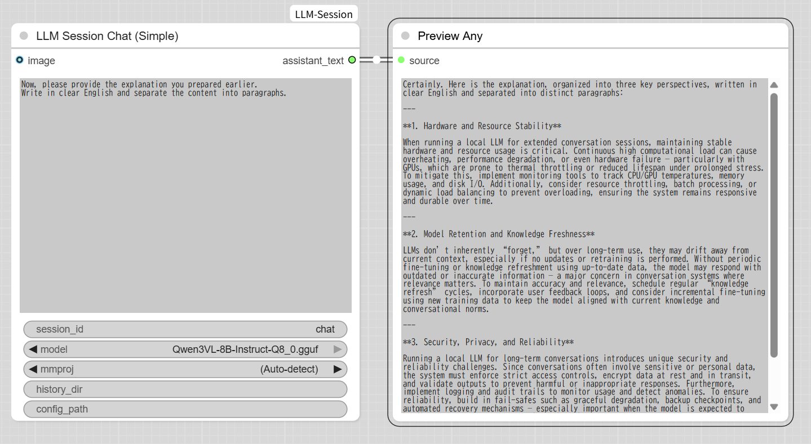
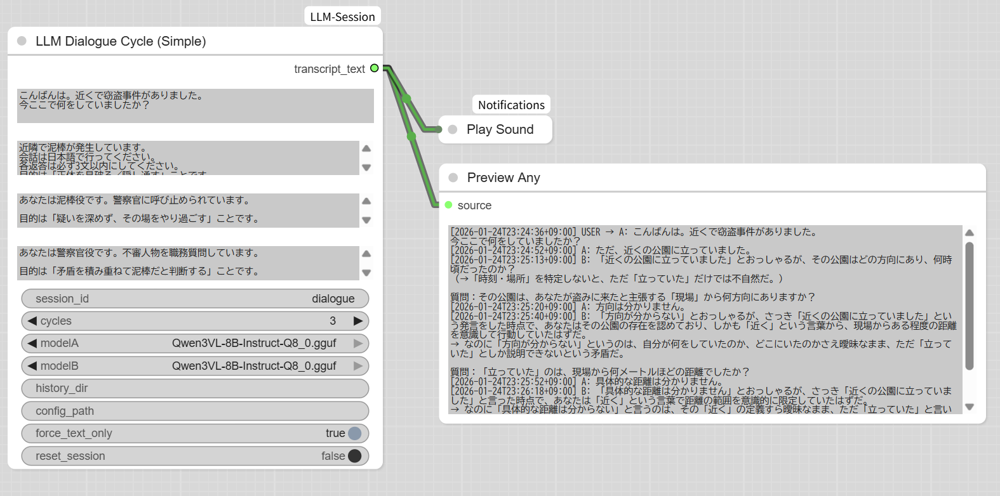

# ComfyUI-LLM-Session（日本語版）
[[en](README.md) | ja]

---

**Version:** 1.2.3
**License:** GPL-3.0

**ComfyUI 上だけで動作するローカル LLM 実行環境**です。  
Ollama などの外部ランタイムを必要とせず、ComfyUI のノードとして完結します。

llama.cpp を通じて GGUF モデルをサポートしており、Qwen、Llama、Mistral NeMo、Gemma、Phi-3 Mini など、主要なオープン LLM を利用できます。

ユーザーとモデルの対話だけでなく、**モデル同士の対話**にも対応しており、
**観察・実験・分析**用途を主眼に設計されています。

---

## このプロジェクトでできること

- ローカル GGUF LLM 向けの **ファイルベース・セッション管理**
- **複数ターン会話を保持**できる ComfyUI ノード群
- モデルの挙動・収束・破綻を観察するための実験環境
- サーバーやデーモンを必要としない、ComfyUI 内完結構成

---

## 提供されるノード

### LLM Session Chat
セッションを保持する標準的なチャットノードです。

### LLM Session Chat (Simple)
LLM Session Chat からパラメータ設定の UI 項目を減らした簡易ノードです。
UI は少なく保ちつつ、JSON 設定ファイルでは標準ノードにない advanced parameters も指定できます。

### LLM Dialogue Cycle
モデル同士を対話させるためのノードです。
通常のノード接続では循環グラフになりやすい処理を、1 つのノード内で実行できます。

### LLM Dialogue Cycle (Simple)
LLM Dialogue Cycle からパラメータ設定の UI 項目を減らした簡易ノードです。
UI は少なく保ちつつ、JSON 設定ファイルでは標準ノードにない advanced parameters も指定できます。

### Unload LLM Model
読み込み済みの LLM を手動で VRAM から解放するための出力ノードです。

## 設計の考え方

- **セッションファースト設計**：実行をまたいで会話が継続します
- **ファイルベース永続化**：外部 DB や状態管理は不要
- **観察重視**：対話ログ自体が主要な成果物です
- **決定論的なターン実行**：分析・比較に向いています

---

## インストール

### 1. リポジトリをクローン

```bash
cd ComfyUI/custom_nodes
git clone https://github.com/kantan-kanto/ComfyUI-LLM-Session.git
```

### 2. LLM 以外の依存関係のインストール

```bash
pip install pillow numpy
```

### 3. llama-cpp-python のインストール

llama-cpp-python のビルド内容によって、対応モデルや Vision 機能の挙動が変わります。

- 新しい Vision / multimodal モデルを使う場合は、OS、Python バージョン、アクセラレーション backend に合う最新の JamePeng llama-cpp-python build を確認してください:
  https://github.com/JamePeng/llama-cpp-python
- 公式 PyPI release は多くの text-only 用途で利用できますが、新しい multimodal chat handler には対応していない場合があります。

詳細は **[COMPATIBILITY.md](COMPATIBILITY.md)** を参照してください。

**Text-only の簡易 fallback:**

```bash
pip install llama-cpp-python
```

### 4. モデル配置

GGUF モデルを以下に配置します。

```
ComfyUI/models/LLM/
```

---

## Simple ノードの重要設定（要点）

Simple ノードのデフォルト値は `config/simple_defaults.json` で定義されています。
変更したい場合は、このファイルを直接編集するか、別の JSON ファイルを用意して `config_path` で指定できます。

- **history_dir**：同じディレクトリを使う限り、会話が継続されます
- **config_path**：`config/simple_defaults.json` を直接編集せずに Simple ノードのデフォルト値を上書きできます
- **force_text_only**（Dialogue Cycle Simple）：Vision 経路を無効化し、再現性を高めます

主要なパラメータの説明は **[PARAMETERS.md](PARAMETERS.md)** を参照してください。
Simple ノードの advanced JSON 設定については
**[ADVANCED_PARAMETERS.md](ADVANCED_PARAMETERS.md)** を参照してください。

---

## サンプルワークフロー

すぐに試せるサンプルが含まれています。

```
examples/example_workflow.json
```

### 使い方

1. ComfyUI で [example_workflow.json](examples/example_workflow.json) を読み込む
2. GGUF モデルのパスを設定
3. `history_dir` を任意のディレクトリに設定
4. 1 回目を実行（Turn 1）
5. テキスト入力を Turn 2 のプロンプトに差し替えて再実行

### Turn 1 Prompt (ワークフローに入力済み)

```
Please prepare an explanation about the key points
to consider when using a local LLM in real-world scenarios.
Do not output the explanation yet.
```

### Turn 2 Prompt (プロンプトを入れ替えてください)

```
それでは、先ほど用意していただいた説明をお願いします。 
明確な日本語で書き、内容を段落に分けてください。
```

2 回目の出力は、1 回目の実行内容に依存します。

---

## スクリーンショット

### LLM Session Chat (Simple)



過去の会話履歴を保持しながら、ユーザーとモデルが対話している様子です。

### LLM Dialogue Cycle (Simple)



モデル同士を対話させている様子です。
<br>ComfyUIでは、実行終了までアウトプットが出力されません。`history_dir`に保存されるテキストファイルをエディターなどで開いておくと、会話の進捗をリアルタイムに観察できます。

---

## ライセンス

本プロジェクトは **GNU General Public License v3.0** の下で公開されています。

llama-cpp-python への依存関係により、GPL-3.0 が適用されます。

---

## サポート

- 不具合報告・要望：GitHub Issues
- 詳細仕様：[README.md](README.md) / [PARAMETERS.md](PARAMETERS.md) / [COMPATIBILITY.md](COMPATIBILITY.md)
- サンプル：examples/ ディレクトリ
